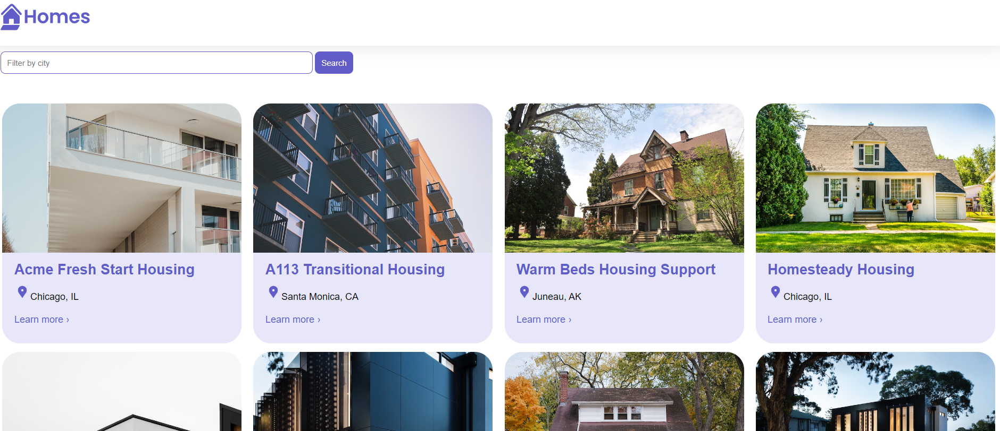

# Angular Homes App

# About project

### Part 1 ( Customizing components and directives )

- Built the structure for the Housing Component
- Made the Housing component customizable using Input properties
- Used for ngFor directive to iterate over the housingLocationList array.

### Part 2 ( How to route in Angular )

- Navigated using the Angular router and the routelink directive.
- Using the parameterized routes.
- using the ActivedRoute feature.

### Part 3 ( Services in Angular )

- How to create a service.
- How to use dependency injection in components.

### Part 4 ( Forms Angular )

- Angular Forms, formGroup and formControl
- formGroup to an HTML form in a template.
- event binding in Angular

### Part 5 ( Http in Angular)

- HTTP Request to live endpoint using json-server
- Refractored to use promises and async code
- filtering capabilities to app with template variables

------------------------
### Build

- Install Angular if you don't have it installed

  `npm install -g @angular/cli`

- Clone this branch to your local machine

  `git clone -b homes-app-start git@github.com:angular/codelabs.git homes-app`

- Once the code has been downloaded

  `cd homes-app`

- Install the depencies

  `npm install` 

- Run the application 

  `ng serve`